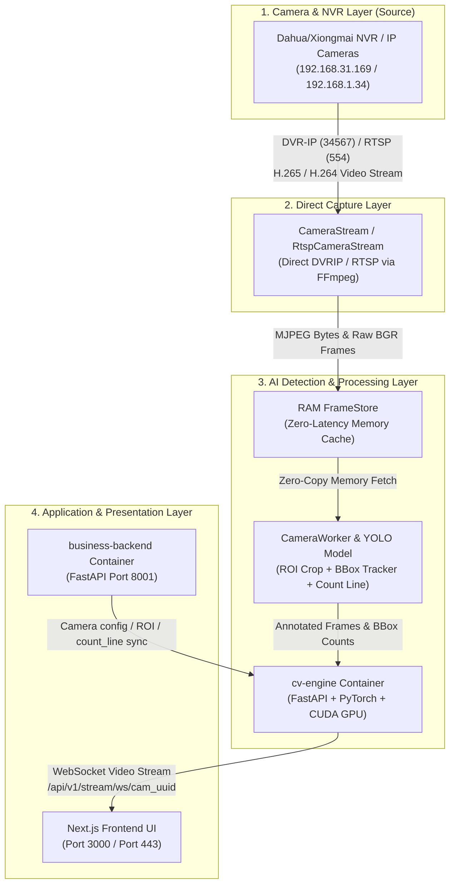

# Warehouse Automation — AI Video Analytics & Box Counting System

AI-powered real-time warehouse monitoring, box detection, object tracking, and virtual line counting system built with High-Performance PyTorch/YOLO inference, CUDA GPU acceleration, zero-latency RAM frame caching, and direct DVRIP/RTSP capture (no go2rtc).

---

## 🏗️ Network Streaming Architecture



---

## ⚙️ Component & Layer Breakdown

| Layer | Component | Protocol / Port | Responsibilities & Data Flow |
| :--- | :--- | :--- | :--- |
| **1. Source** | NVR / IP Camera | DVR-IP (`34567`) / RTSP (`554`) | Connects directly to hardware; no intermediate bridge service. |
| **2. Capture** | `CameraStream` / `RtspCameraStream` | Direct DVRIP / RTSP via FFmpeg | Decodes H.265/H.264 into low-latency JPEG frames pushed to the RAM FrameStore. |
| **3. Memory Cache** | `FrameStore` | RAM Lock Cache | Stores raw BGR NumPy arrays and JPEG bytes in system RAM memory with 0ms disk I/O latency. |
| **3. Analytics** | `CameraWorker` | PyTorch / CUDA GPU | Crops ROI polygon for fast YOLO box detection, tracks object IDs across frames, and updates count-line crossing totals. |
| **4. Business Backend** | `business-backend` | REST API (`8001`) | Handles NVR camera CRUD operations, stores settings in PostgreSQL, and pushes camera config (ROI, count_line, model) to the AI engine. |
| **4. UI** | Next.js Frontend | WebSocket (`/api/v1/stream/ws/...`) | Renders real-time annotated live video streams and live box count metrics over WebSocket (<100ms latency). |

---

## 🚀 Deployment & Quick Start

### Docker Production Deployment

To start the full application stack with GPU acceleration:

```bash
git pull
docker compose down
docker compose build --no-cache
docker compose up -d
```

### Checking Services & Logs

```bash
# Verify container health
docker compose ps

# View live CV Engine logs
docker compose logs --tail 60 -f cv-engine
```

---

## 🧪 Verification & Testing

Run the full pytest backend test suite (70 tests):

```bash
cd backend
pytest
```
