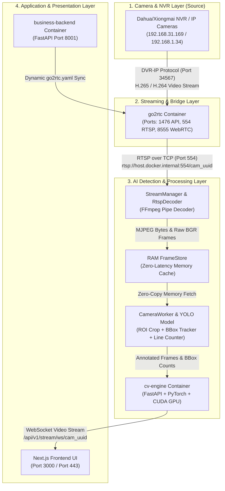

# Warehouse Automation — AI Video Analytics & Box Counting System

AI-powered real-time warehouse monitoring, box detection, object tracking, and virtual line counting system built with High-Performance PyTorch/YOLO inference, CUDA GPU acceleration, zero-latency RAM frame caching, and `go2rtc` stream multiplexing.

---

## 🏗️ Network Streaming Architecture



---

## ⚙️ Component & Layer Breakdown

| Layer | Component | Protocol / Port | Responsibilities & Data Flow |
| :--- | :--- | :--- | :--- |
| **1. Source** | NVR / IP Camera | DVR-IP (`34567`) / RTSP (`554`) | Single connection reader. `go2rtc` is the **only service** connecting directly to hardware to eliminate NVR CPU overhead. |
| **2. Bridge** | `go2rtc` | REST (`1476`) / RTSP (`554`) | Multiplexes DVR-IP streams into RTSP endpoints. Config (`go2rtc.yaml`) is auto-generated dynamically by `business-backend` with Camera UUID keys. |
| **3. AI Engine** | `cv-engine` (`RtspDecoder`) | RTSP over TCP | FFmpeg pipe decoder pulling H.265 (HEVC) / H.264 streams from `go2rtc` and decoding into low-latency JPEG image streams. |
| **3. Memory Cache** | `FrameStore` | RAM Lock Cache | Stores raw BGR NumPy arrays and JPEG bytes in system RAM memory with 0ms disk I/O latency. |
| **3. Analytics** | `CameraWorker` | PyTorch / CUDA GPU | Crops ROI polygon for fast YOLO box detection, tracks object IDs across frames, and updates virtual line crossing count totals. |
| **4. Business Backend** | `business-backend` | REST API (`8001`) | Handles NVR camera CRUD operations, stores settings in PostgreSQL, and generates dynamic `go2rtc.yaml` configurations. |
| **4. UI** | Next.js Frontend | WebSocket (`/api/v1/stream/ws/...`) | Renders real-time annotated live video streams and live box count metrics over WebSocket (<100ms latency). |

---

## 🚀 Deployment & Quick Start

### Docker Production Deployment

To start the full application stack with GPU acceleration:

```bash
git pull
docker compose down
docker compose build --no-cache
docker compose up -d
```

### Checking Services & Logs

```bash
# Verify container health
docker compose ps

# View live CV Engine logs
docker compose logs --tail 60 -f cv-engine

# View go2rtc streaming bridge logs
docker compose logs --tail 50 go2rtc
```

---

## 🧪 Verification & Testing

Run the full pytest backend test suite (56 tests):

```bash
cd backend
pytest
```
